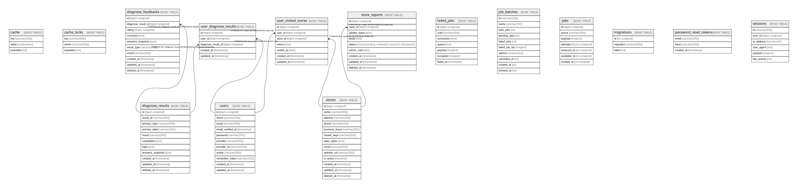

<p align="center">
  
</p>

<h1 align="center">5akeMe（サケミー）</h1>

<p align="center">
  診断から「お酒の好み」を推定し、あなたにぴったりの一杯をレコメンドする Web アプリ
</p>

<p align="center">
  
  
  
  
  
  
</p>

---

## 概要

**5akeMe** は、5 問の診断で 10 種類の酒タイプからあなたの好みを推定し、最適なお酒と店舗をレコメンドするプロトタイプです。

<p align="center">
  
</p>

### 主な機能

- **お酒診断** — 気分・好みに関する 5 問に回答するだけで、10 種類の酒タイプにスコアリング。primary / candidates / mood を出力
- **AI スコアリング** — Python (FastAPI + scikit-learn) による機械学習ベースの診断エンジン
- **SNS ログイン** — Google / LINE / X による OAuth 認証（メール・パスワード認証も対応）
- **店舗レコメンド** — 診断結果に合った店舗を提案。訪問記録・メモ・通報機能も搭載
- **管理画面** — Filament によるユーザー・店舗・通報・診断フィードバックの管理

---

## 技術スタック

| レイヤー | 技術 |
|----------|------|
| **Backend** | PHP 8.3 / Laravel 12 / Breeze / Socialite / Filament 3 |
| **Frontend** | Blade + Vite 7 + Tailwind CSS 3 + Alpine.js 3 |
| **AI / 診断** | Python 3 / FastAPI / scikit-learn / pandas / NumPy |
| **Database** | MySQL 8.0 |
| **Infra** | Docker Compose / Nginx / PHP-FPM / Node.js 20 |
| **CI** | GitHub Actions (PHPUnit) |

詳細は [docs/TECH_STACK.md](docs/TECH_STACK.md) を参照してください。

---

## クイックスタート

### 前提条件

- [Docker](https://www.docker.com/) / Docker Compose

### セットアップ

```bash
# 1. リポジトリをクローン
git clone https://github.com/Ryoya0816/5akeMe.git
cd 5akeMe

# 2. 環境変数を準備
cp .env.example .env

# 3. コンテナを起動
docker compose up -d

# 4. 初期化
docker compose exec app php artisan optimize:clear
docker compose exec app php artisan migrate
```

ブラウザで **http://localhost:8082** を開いてください。

### テストユーザーでログイン

```bash
docker compose exec app php artisan user:create-hello
```

表示されたメールアドレスとパスワードで [http://localhost:8082/login](http://localhost:8082/login) にログインできます。

> **Tip:** ログイン直後にログアウトされる場合は `api/.env` の `SESSION_DRIVER` を `database` に変更し、`docker compose exec app php artisan config:clear` を実行してください。

### フロント資産のビルド

```bash
# Docker 内でビルド
make assets

# 開発サーバー (HMR)
make assets-dev
```

---

## コンテナ構成

| サービス | ポート | 役割 |
|----------|--------|------|
| **web** (Nginx) | 8082 | リバースプロキシ・静的配信 |
| **app** (PHP-FPM) | — | Laravel アプリケーション |
| **db** (MySQL) | 3306 | データベース |
| **node** (Node.js) | 5174 | Vite 開発サーバー |
| **python** (FastAPI) | 8000 | AI 診断 API |
| **phpmyadmin** | 8081 | DB 管理 UI（開発用） |

---

## リポジトリ構成

```
5akeMe/
├── api/                  # Laravel アプリケーション
│   ├── app/Services/     #   診断ロジック・画像処理
│   ├── config/diagnose.php #   診断設定（types / weights / scoring）
│   ├── resources/        #   Blade テンプレート・CSS・JS
│   └── tests/            #   PHPUnit テスト
├── python/               # Python AI サービス（FastAPI）
├── docker/               # Dockerfile（PHP / Nginx / Python）
├── docs/                 # 設計・運用ドキュメント
├── scripts/              # デプロイ用スクリプト
├── docker-compose.yml    # ローカル開発用
└── Makefile              # ビルド・デプロイコマンド
```

---

## 診断ロジック

1. **固定 2 問**（q1: 気分 / q2: お酒に求めるもの）＋ **カテゴリ A/B/C から各 1 問** = 計 5 問
2. `config/diagnose.php` の weights に基づいてタイプ別にスコア加点（q2 は `q2_multiplier` 適用）
3. 最大スコアのタイプが **primary**、差が `candidate_width` 以内が **candidates**、q1 から **mood** を決定

精度改善の方針は [docs/DIAGNOSE_ACCURACY.md](docs/DIAGNOSE_ACCURACY.md) を参照してください。

---

## ER 図

<details>
<summary>クリックして展開</summary>



</details>

---

## Make コマンド

| コマンド | 説明 |
|----------|------|
| `make assets` | npm ci + npm run build（Docker 内） |
| `make assets-dev` | Vite 開発サーバー起動 |
| `make docs` | tbls で DB ドキュメント生成 |
| `make deploy` | 本番デプロイ（キャッシュクリア → ビルド → マイグレーション） |
| `make health` | ヘルスチェック |

---

## ドキュメント

| ファイル | 内容 |
|----------|------|
| [api/README.md](api/README.md) | 開発・セットアップ詳細 |
| [docs/TECH_STACK.md](docs/TECH_STACK.md) | 技術スタック・コンテナ構成 |
| [docs/DIAGNOSE_ACCURACY.md](docs/DIAGNOSE_ACCURACY.md) | 診断精度の改善方針 |
| [docs/SNS_LOGIN.md](docs/SNS_LOGIN.md) | SNS ログイン（Google / LINE / X）設定 |
| [docs/README.md](docs/README.md) | DB スキーマ・ER 図の生成方法 |
| [DEPLOYMENT.md](DEPLOYMENT.md) | 本番デプロイ手順 |

---

## ライセンス

This project is private.
