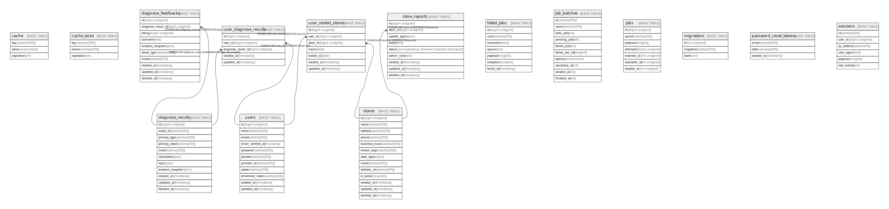

# laravel

## テーブル一覧

| テーブル名（日本語） | Name | Columns | Comment | Type |
| ---- | ---- | ------- | ------- | ---- |
| ユーザー | [users](users.md) | 11 | ユーザー情報 | BASE TABLE |
| 店舗 | [stores](stores.md) | 13 | 店舗情報 | BASE TABLE |
| 診断結果 | [diagnose_results](diagnose_results.md) | 11 | お酒診断の結果 | BASE TABLE |
| 診断フィードバック | [diagnose_feedbacks](diagnose_feedbacks.md) | 10 | 診断結果へのフィードバック（評価・コメント） | BASE TABLE |
| ユーザー診断結果 | [user_diagnose_results](user_diagnose_results.md) | 5 | ユーザーと診断結果の紐付け | BASE TABLE |
| ユーザー訪問店舗 | [user_visited_stores](user_visited_stores.md) | 7 | ユーザーが訪問した店舗の記録 | BASE TABLE |
| 店舗レポート | [store_reports](store_reports.md) | 9 | 店舗情報の報告・修正依頼 | BASE TABLE |
| キャッシュ | [cache](cache.md) | 3 | Laravelキャッシュ | BASE TABLE |
| キャッシュロック | [cache_locks](cache_locks.md) | 3 | Laravelキャッシュロック | BASE TABLE |
| 失敗ジョブ | [failed_jobs](failed_jobs.md) | 7 | Laravel失敗したジョブ | BASE TABLE |
| ジョブバッチ | [job_batches](job_batches.md) | 10 | Laravelジョブバッチ | BASE TABLE |
| ジョブ | [jobs](jobs.md) | 7 | Laravelキュージョブ | BASE TABLE |
| マイグレーション | [migrations](migrations.md) | 3 | Laravelマイグレーション履歴 | BASE TABLE |
| パスワードリセットトークン | [password_reset_tokens](password_reset_tokens.md) | 3 | Laravelパスワードリセット | BASE TABLE |
| セッション | [sessions](sessions.md) | 6 | Laravelセッション | BASE TABLE |

## Relations

---

> Generated by [tbls](https://github.com/k1LoW/tbls)
