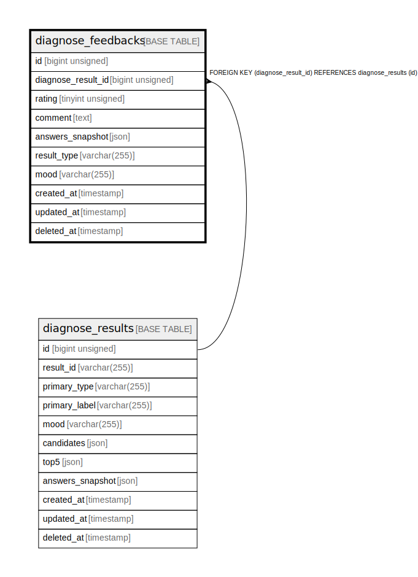

# diagnose_feedbacks

## Description

<details>
<summary><strong>Table Definition</strong></summary>

```sql
CREATE TABLE `diagnose_feedbacks` (
  `id` bigint unsigned NOT NULL AUTO_INCREMENT,
  `diagnose_result_id` bigint unsigned NOT NULL,
  `rating` tinyint unsigned NOT NULL,
  `comment` text COLLATE utf8mb4_unicode_ci,
  `answers_snapshot` json DEFAULT NULL,
  `result_type` varchar(255) COLLATE utf8mb4_unicode_ci DEFAULT NULL,
  `mood` varchar(255) COLLATE utf8mb4_unicode_ci DEFAULT NULL,
  `created_at` timestamp NULL DEFAULT NULL,
  `updated_at` timestamp NULL DEFAULT NULL,
  `deleted_at` timestamp NULL DEFAULT NULL,
  PRIMARY KEY (`id`),
  KEY `diagnose_feedbacks_diagnose_result_id_foreign` (`diagnose_result_id`),
  KEY `diagnose_feedbacks_rating_index` (`rating`),
  KEY `diagnose_feedbacks_result_type_index` (`result_type`),
  KEY `diagnose_feedbacks_mood_index` (`mood`),
  CONSTRAINT `diagnose_feedbacks_diagnose_result_id_foreign` FOREIGN KEY (`diagnose_result_id`) REFERENCES `diagnose_results` (`id`) ON DELETE CASCADE
) ENGINE=InnoDB AUTO_INCREMENT=[Redacted by tbls] DEFAULT CHARSET=utf8mb4 COLLATE=utf8mb4_unicode_ci
```

</details>

## Columns

| Name | Type | Default | Nullable | Extra Definition | Children | Parents | Comment |
| ---- | ---- | ------- | -------- | ---------------- | -------- | ------- | ------- |
| id | bigint unsigned |  | false | auto_increment |  |  |  |
| diagnose_result_id | bigint unsigned |  | false |  |  | [diagnose_results](diagnose_results.md) |  |
| rating | tinyint unsigned |  | false |  |  |  |  |
| comment | text |  | true |  |  |  |  |
| answers_snapshot | json |  | true |  |  |  |  |
| result_type | varchar(255) |  | true |  |  |  |  |
| mood | varchar(255) |  | true |  |  |  |  |
| created_at | timestamp |  | true |  |  |  |  |
| updated_at | timestamp |  | true |  |  |  |  |
| deleted_at | timestamp |  | true |  |  |  |  |

## Constraints

| Name | Type | Definition |
| ---- | ---- | ---------- |
| diagnose_feedbacks_diagnose_result_id_foreign | FOREIGN KEY | FOREIGN KEY (diagnose_result_id) REFERENCES diagnose_results (id) |
| PRIMARY | PRIMARY KEY | PRIMARY KEY (id) |

## Indexes

| Name | Definition |
| ---- | ---------- |
| diagnose_feedbacks_diagnose_result_id_foreign | KEY diagnose_feedbacks_diagnose_result_id_foreign (diagnose_result_id) USING BTREE |
| diagnose_feedbacks_mood_index | KEY diagnose_feedbacks_mood_index (mood) USING BTREE |
| diagnose_feedbacks_rating_index | KEY diagnose_feedbacks_rating_index (rating) USING BTREE |
| diagnose_feedbacks_result_type_index | KEY diagnose_feedbacks_result_type_index (result_type) USING BTREE |
| PRIMARY | PRIMARY KEY (id) USING BTREE |

## Relations



---

> Generated by [tbls](https://github.com/k1LoW/tbls)
