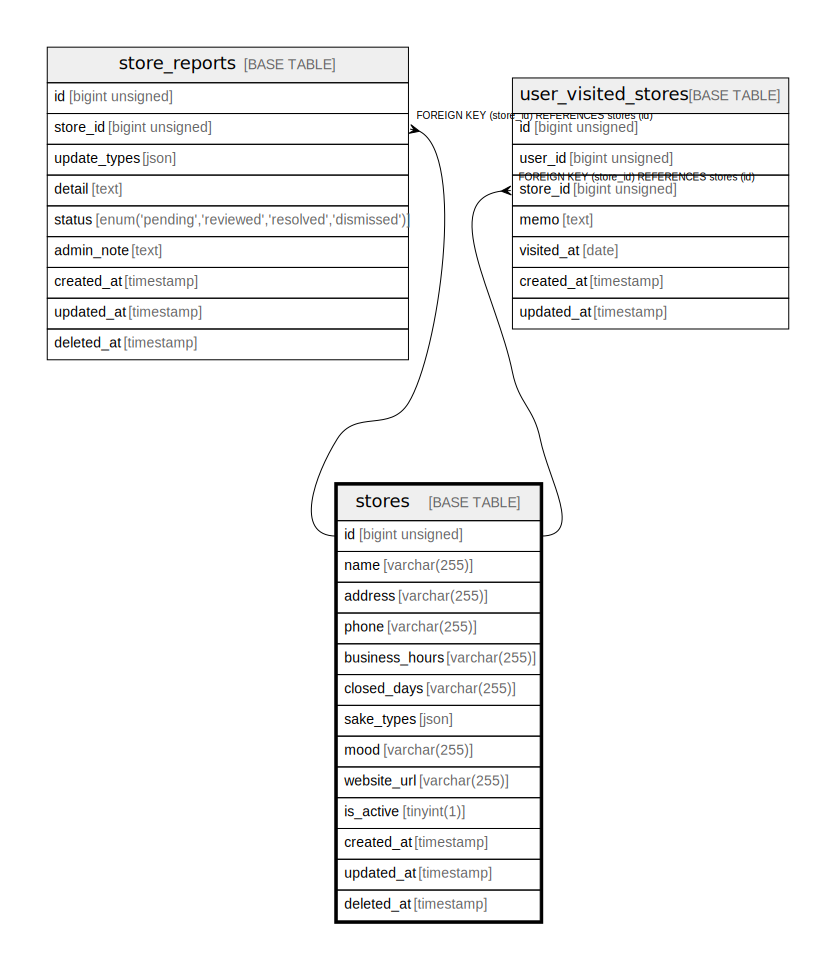

# stores

## Description

<details>
<summary><strong>Table Definition</strong></summary>

```sql
CREATE TABLE `stores` (
  `id` bigint unsigned NOT NULL AUTO_INCREMENT,
  `name` varchar(255) COLLATE utf8mb4_unicode_ci NOT NULL,
  `address` varchar(255) COLLATE utf8mb4_unicode_ci DEFAULT NULL,
  `phone` varchar(255) COLLATE utf8mb4_unicode_ci DEFAULT NULL,
  `business_hours` varchar(255) COLLATE utf8mb4_unicode_ci DEFAULT NULL,
  `closed_days` varchar(255) COLLATE utf8mb4_unicode_ci DEFAULT NULL,
  `sake_types` json DEFAULT NULL,
  `mood` varchar(255) COLLATE utf8mb4_unicode_ci DEFAULT NULL,
  `website_url` varchar(255) COLLATE utf8mb4_unicode_ci DEFAULT NULL,
  `is_active` tinyint(1) NOT NULL DEFAULT '1',
  `created_at` timestamp NULL DEFAULT NULL,
  `updated_at` timestamp NULL DEFAULT NULL,
  `deleted_at` timestamp NULL DEFAULT NULL,
  PRIMARY KEY (`id`)
) ENGINE=InnoDB AUTO_INCREMENT=[Redacted by tbls] DEFAULT CHARSET=utf8mb4 COLLATE=utf8mb4_unicode_ci
```

</details>

## Columns

| Name | Type | Default | Nullable | Extra Definition | Children | Parents | Comment |
| ---- | ---- | ------- | -------- | ---------------- | -------- | ------- | ------- |
| id | bigint unsigned |  | false | auto_increment | [store_reports](store_reports.md) [user_visited_stores](user_visited_stores.md) |  |  |
| name | varchar(255) |  | false |  |  |  |  |
| address | varchar(255) |  | true |  |  |  |  |
| phone | varchar(255) |  | true |  |  |  |  |
| business_hours | varchar(255) |  | true |  |  |  |  |
| closed_days | varchar(255) |  | true |  |  |  |  |
| sake_types | json |  | true |  |  |  |  |
| mood | varchar(255) |  | true |  |  |  |  |
| website_url | varchar(255) |  | true |  |  |  |  |
| is_active | tinyint(1) | 1 | false |  |  |  |  |
| created_at | timestamp |  | true |  |  |  |  |
| updated_at | timestamp |  | true |  |  |  |  |
| deleted_at | timestamp |  | true |  |  |  |  |

## Constraints

| Name | Type | Definition |
| ---- | ---- | ---------- |
| PRIMARY | PRIMARY KEY | PRIMARY KEY (id) |

## Indexes

| Name | Definition |
| ---- | ---------- |
| PRIMARY | PRIMARY KEY (id) USING BTREE |

## Relations



---

> Generated by [tbls](https://github.com/k1LoW/tbls)
